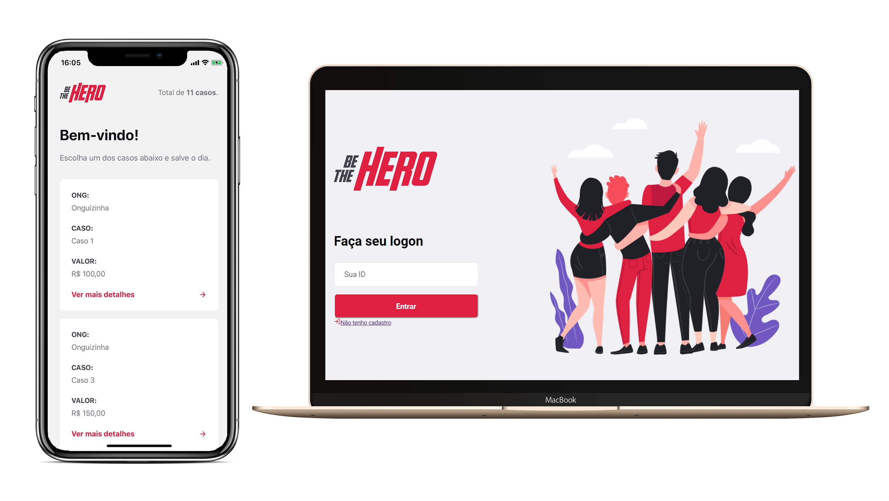

<h1 align="center">
    
</h1>

<h4 align="center">
 	Be The Hero - Help who needs you!
</h4>

 

  

## 💻 Project

If you are an ONG, create your account and register some incidents. The heroes will use the mobile app to help in your incident!

## :rocket: Techs

- [Node.js]
- [Knex]
- [ReactJS]
- [React Native]
- [Axios]
- [Cors]

---

☕ Glauber Brack - <a href="mailto:glauber@brack.com.br?Subject=Hello%20you">Mail me!</a> 
